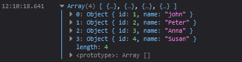

# AJAX - FETCH

This is a more popular approach in the sense that we use modern techniques and that Fetch already includes the response.json functionality that allows us to parse the data without having to call extenal methods.

- Built into JS just like XHR

- Fetch is just an alternative that has simpler and cleaner Syntax, the end result is still the same, with less code.

- Promise Based Approach

### Response & Data Flow

> - Useful Props and Methods
> - Convert Response into JSON
> - Returns a Promise 

After requesting the promise we need to handle the response and the data received using the following method: 

```javascript
// API URL
fetch(url).then((response) => {
  /*Useful Values */
  let connectionData = {
    status: response.status,
    statusText: response.statusText,
    ok: response.ok
  }
  console.log(connectionData)
  /* Return JSON Data Promise */
  return response.json()
}).then((data) => {
  /* Access Promise Parsed JSON Data*/
  console.log(data)
}).catch((error) => {
  console.log(1,error)
})
```

### Implicit Return

This method allows to use implicit return in the `.then()` to omit the `return` keyword and shorten the lines of code required, `res.json` returns a promise. 

`res.json` is returned implicitly and the following `then` will relay it and log it.

```javascript
/* One Line Implicit return */
fetch(url).then((res)=> res.json()).then(data => {console.log(data)})
```


